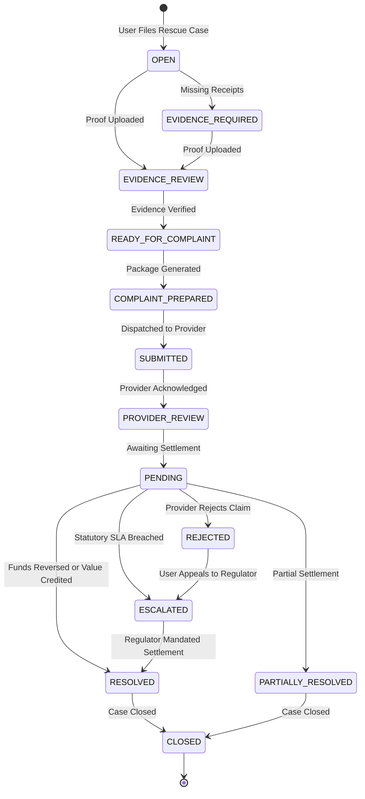

# PAYRESCUE NG — System Architecture & Design Documentation

## 1. Executive Mission
**PayRescue** is Nigeria's premier digital transaction recovery, evidence verification, and payment reconciliation infrastructure. Unlike conventional VTU reselling portals, PayRescue operates as an independent dispute resolution and multi-tenant reconciliation fabric under the core architectural paradigm:
> **"One transaction → one rescue case."**

---

## 2. Core Architectural Pillars

### A. Immutable Financial Transaction Ledger
Financial records in PayRescue are append-only. When a transaction is ingested via user entry, API, CSV settlement import, or bank webhook:
- An internal unique reference (`PRTX-YYYYMMDD-XXXX`) is assigned alongside the public reference (e.g., NIBSS NIP Session ID, Bank RRN, or Gateway Reference).
- Status changes (from `PENDING` to `SUCCESS`, `REVERSED`, or `DISPUTED`) are recorded as immutable `TransactionEvent` entities capturing the actor, previous status, new status, timestamp, and audit payload. Financial history is never overwritten.

### B. Cryptographic Evidence Vault
Receipts, SMS debit alerts, and PDF account statements are handled with strict integrity constraints:
- SHA-256 digests are computed immediately upon receipt to guarantee non-repudiation.
- Pluggable storage abstraction supporting local disk, AWS S3/MinIO, and Cloudinary.
- Pluggable ClamAV malware scanning interface to ensure zero malicious payloads enter the repository.
- **Strict Admissibility Principle**: A screenshot alone is *never* treated as definitive proof that payment succeeded. External independent verification or statutory NIP Session ID tracking is required before confirming value delivery.

### C. Rules-Based Dispute Classification Engine
Configurable heuristics classify dispute claims into statutory categories:
- `DEBITED_NOT_CREDITED`: Electronic funds transfer debited from originating bank without recipient ledger credit.
- `FAILED_SERVICE`: Telecom airtime/data payment completed without line balance increment.
- `SERVICE_NOT_RECEIVED`: Prepaid electricity token unissued or meter uncredited.
- `DUPLICATE`: Twin debits against an identical reference within statutory windows.
- `WRONG_AMOUNT`: Discrepancies between billed invoice and actual settled charge.

### D. Provider Adapter Architecture
Instead of scattering provider-specific logic across controllers, PayRescue encapsulates provider interactions behind a uniform `ProviderAdapter` interface:
- **Banks**: Validates 30-digit NIBSS Session IDs and 12-digit RRNs; binds complaints to the CBN Consumer Protection Framework circular (FPR/DIR/GEN/CIR/01/020) with a 72-hour statutory SLA.
- **Telecoms**: Validates VTU references; binds complaints to the NCC Consumer Code of Practice with a 24-hour SLA.
- **Electricity DisCos**: Validates meter numbers and aggregator IDs; binds complaints to NERC standards with a 24-hour SLA.
- **Payment Gateways**: Integrates webhook verification (e.g. Paystack HMAC-SHA512).

### E. Multi-Tenant Business Isolation
PayRescue supports multi-tenant retail and enterprise operations:
- Every business account is isolated at the database query layer via `tenantIsolation` middleware.
- Members hold granular roles (`BUSINESS_OWNER`, `BUSINESS_ADMIN`, `BUSINESS_AGENT`).
- Automated reconciliation correlates customer claims against merchant bank statement CSVs, outputting `MATCHED`, `PARTIAL_MATCH`, `UNMATCHED`, and `MISMATCH` line items.

### F. Developer Platform (TrustPay API)
- SHA-256 hashed API keys with live and test environment separation.
- Outgoing webhooks signed via HMAC SHA-256 (`X-PayRescue-Signature`) with automated retry logging.
- Idempotency guarantees via `Idempotency-Key` header with a 24-hour cache window.

---

## 3. Case Lifecycle State Machine

